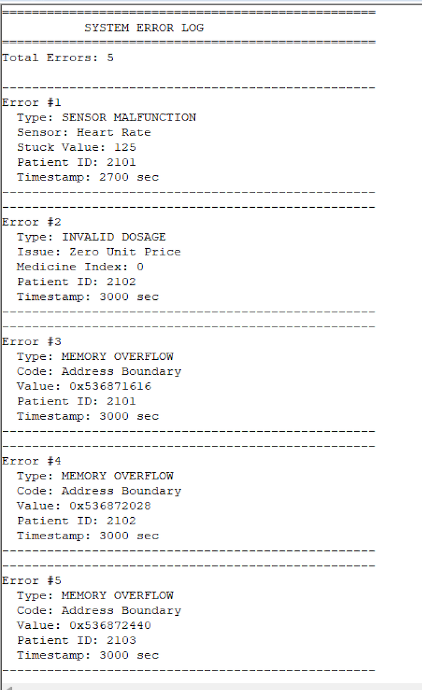

# **SmartCare-32: Healthcare Monitoring & Billing System**

## **Overview**

SmartCare-32 is an embedded healthcare monitoring and billing system built for ARM Cortex-M4 microcontrollers. It provides real-time monitoring of patient vitals, manages medicine administration, calculates treatment and room costs, and generates detailed reports with error detection and logging capabilities.

## **Key Features**

- Real-time monitoring of vital signs: Heart Rate (HR), Oxygen (O2), Systolic/Diastolic Blood Pressure (SBP/DBP)
- Automated alerts for abnormal vitals
- Medicine administration scheduling and tracking
- Multi-component billing system with overflow detection
- Sorting patients by criticality
- UART/ITM-based summary report generation (Module 10)
- Comprehensive error detection and logging (Module 11)

## **Modules**

### **Module 1: Patient Record Initialization**
- Initializes patient data (ID, name, age, ward, treatment code, medicine list, etc.)

### **Module 2: Vital Sign Acquisition**
- Reads sensor data (HR, O2, SBP, DBP) and stores in a rolling buffer.

### **Module 3: Vital Threshold Alert Generation**
- Generates alerts if vital signs exceed predefined thresholds.

### **Module 4: Medicine Administration Scheduler**
- Schedules and tracks medicine administration at fixed intervals.

### **Module 5: Treatment Cost Computation**
- Computes treatment costs based on treatment codes.

### **Module 6: Room Rent Calculation**
- Calculates room rent based on stay duration and daily rate.

### **Module 7: Medicine Billing**
- Computes total medicine cost based on usage.

### **Module 8: Patient Bill Aggregator**
- Aggregates costs into a final bill, including treatment, room, and medicine.

### **Module 9: Patient Sorting by Criticality**
- Sorts patients by the number of alerts to prioritize critical cases.

### **Module 10: UART Report Generation**
- Generates a detailed summary report for each patient and sends it via UART.

### **Module 11: Error Detection & Logging**
- Detects and logs errors such as sensor malfunction, invalid dosage, and memory overflow.

---

## **Technical Specifications**

| **Feature**          | **Specification**                             |
| -------------------- | --------------------------------------------- |
| **Platform**         | ARM Cortex-M4 (ARMv7E-M)                      |
| **IDE**              | Keil µVision 5                                |
| **Language**         | ARM Assembly + C (hybrid)                     |
| **Memory**           | 128 KB SRAM, 1 MB Flash                       |
| **Max Patients**     | 3 (expandable)                                |
| **Vital Buffer**     | 10 entries per patient                        |
| **Alert Buffer**     | 20 entries per patient                        |
| **Error Log**        | 50 error records (simulated Flash)            |

---

## **Project Structure**

```
SmartCare-32/
├── src/
│   ├── module1.s            # Patient Record Initialization
│   ├── module2.s            # Vital Sign Data Acquisition
│   ├── module3.s            # Vital Threshold Alert Module
│   ├── module4.s            # Medicine Administration Scheduler
│   ├── module5.s            # Treatment Cost Computation
│   ├── module6.s            # Daily Room Rent Calculation
│   ├── module7.s            # Medicine Billing Module
│   ├── module8.s            # Patient Bill Aggregator
│   ├── module9.s            # Sorting Patients by Criticality
│   ├── module10.s           # Patient Report Generator
│   ├── module11.s           # Error Detection & Safety Check
│   ├── main.s               # Main module to initialize and call other modules
├── data.s                   # Data definitions, patient structure layouts
├── main.c                   # C code for ITM communication
└── README.md                # Project documentation (this file)
```

---

## **Module 10: UART Summary Report Generator**

**Purpose**: Generates a detailed textual summary report for each patient and sends it via ITM (acting as UART).

### **Main Features**:
- Prints **Patient Information** (ID, Age, Ward)
- Prints **Latest Vital Signs** (HR, O2, BP)
- Displays **Alert Summary** and **Status** (Stable/Moderate/Critical)
- Shows **Billing Summary** (Total Bill)

**Key Functions**:
- `Generate_Summary_Report`: Iterates over all patients, generating and sending the report via ITM.
- `reset_templates`: Resets report templates for each field.
- `push_integer`: Converts integers into a formatted string for UART.
- `PrintByteString`: Sends a byte string to ITM.

### **Sample UART Summary Report**:
Below is a screenshot of the generated UART report for a patient:


## **Module 11: Error Detection & Logging**

**Purpose**: Detects and logs errors related to sensor malfunctions, invalid dosages, and memory overflows.

### **Key Features**:
- **Sensor Malfunction**: Detects when sensor values are stuck (e.g., HR stuck at 125 bpm).
- **Invalid Dosage**: Detects invalid medicine records with zero price or quantity.
- **Memory Overflow**: Monitors memory usage and detects overflow.

### **Error Types**:
1. **Sensor Malfunction**: Error logged when any sensor reading is stuck for 10 consecutive readings.
2. **Invalid Dosage**: Error logged when any medicine has zero price or quantity.
3. **Memory Overflow**: Error logged when memory addresses exceed predefined boundaries.

**Error Record Format**:
```c
typedef struct {
    uint8_t  error_type;
    uint8_t  patient_index;
    uint8_t  error_code;
    uint8_t  padding;
    uint32_t timestamp;
    uint32_t error_value;
    uint32_t patient_id;
} ErrorRecord;
```
### Error Detection Logic

## Sensor Malfunction Detection:

Continuously monitors the sensor readings (e.g., HR, O2, BP) for anomalies.

If a sensor reading stays the same for 10 consecutive readings, it logs a Sensor Malfunction error.

## Invalid Dosage Detection:

Checks each medicine record to ensure that the unit_price and quantity are not zero.

Logs an Invalid Dosage error if either the price or quantity is zero.

## Memory Overflow Detection:

Monitors the memory addresses of patient data.

If the memory pointer exceeds the maximum allowed range (e.g., beyond 0x2001FFFF), it logs a Memory Overflow error.

### Error Logging

Errors are logged in a circular buffer, with a capacity for 50 error records. The logs are stored in memory and can be accessed for further analysis or reporting.

Screenshots of Report and Error Logs

Below is a screenshot of the Error Log generated by Module 11 in action. This log helps in identifying when the system encounters errors related to sensor malfunction, invalid dosages, or memory overflow.


### 1.Build & Deployment

Open Project in Keil µVision 5

Project → Open Project

Select SmartCare.uvprojx

### 2.Build the Project

Project → Rebuild all target files (F7)

Expected result: 0 Errors, 0–1 Warnings

### 3.Debug & Run

Debug → Start/Stop Debug Session (Ctrl+F5)

View → Serial Windows → Debug (printf) Viewer

### License

This project is for educational use only.
